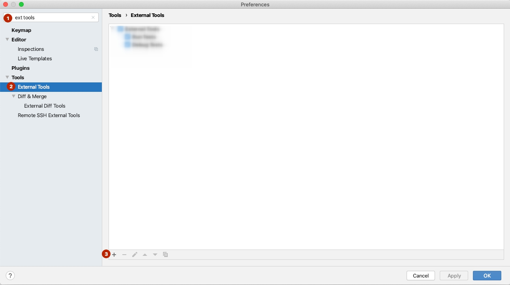
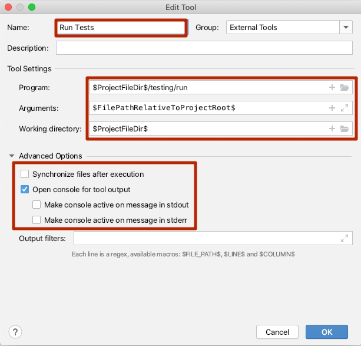
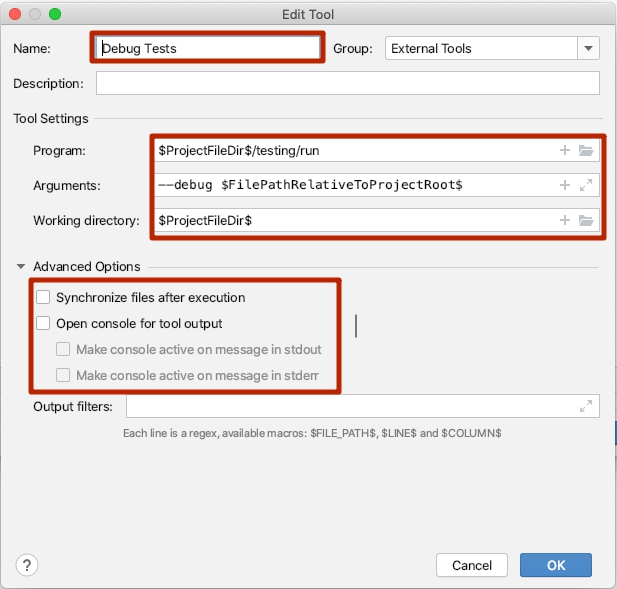
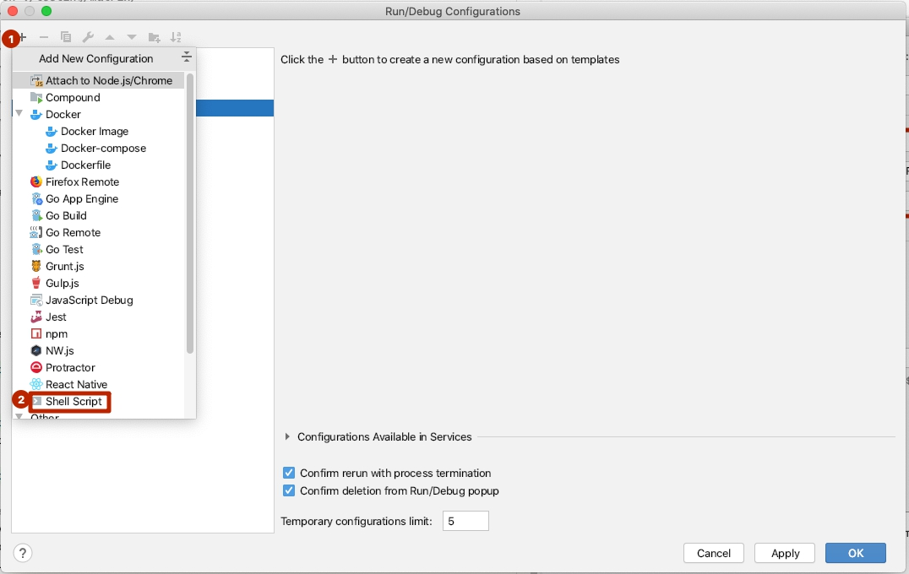
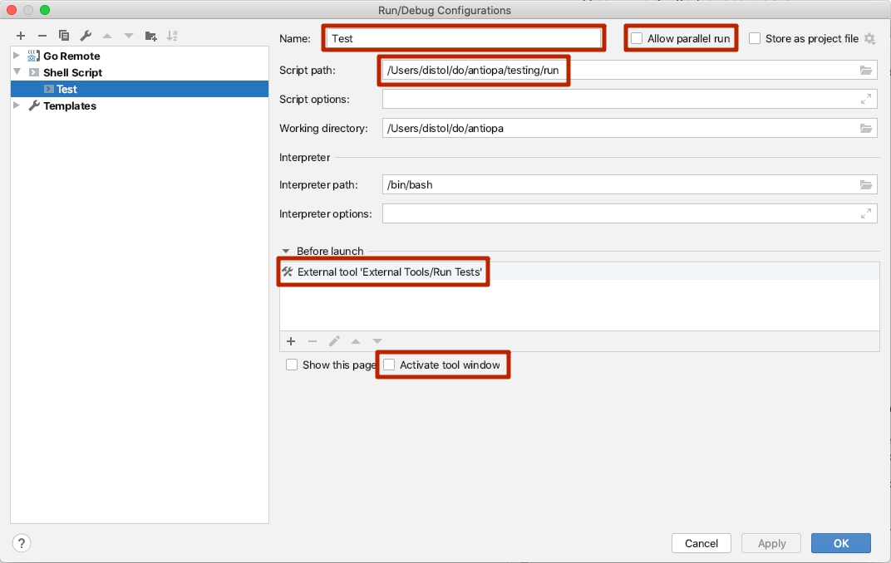
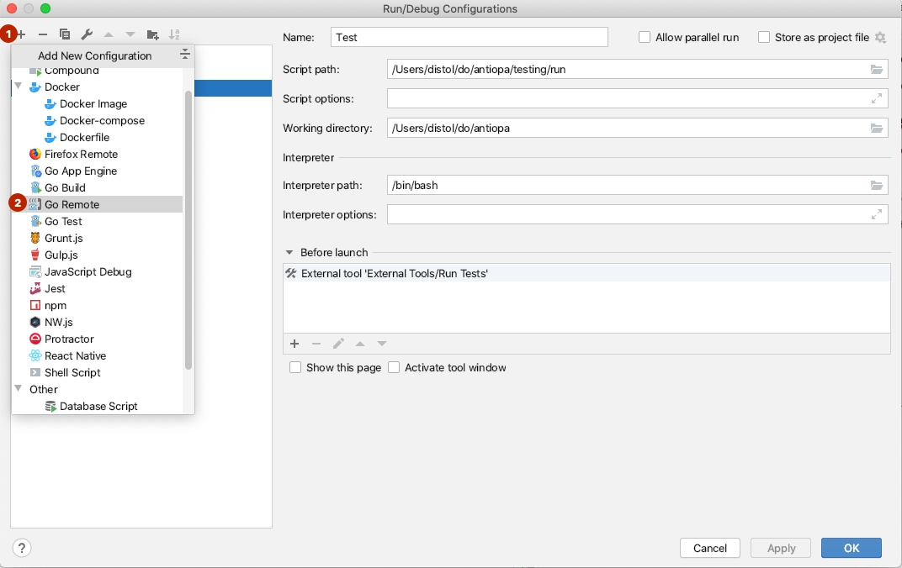
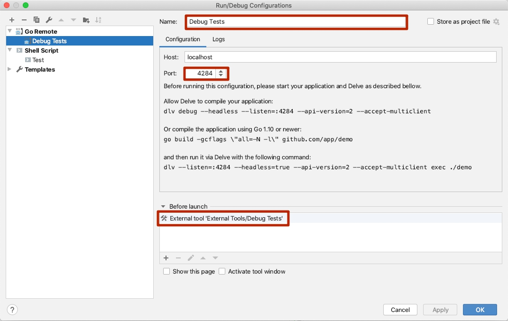

Разработка Deckhouse
====================
- Версия, релиз (существительное) — логически законченная и анонсированная версия программы. Формат смотри подробнее ниже. 
Пример: `20.04` (релиз без хотфиксов), `20.04-hotfix-2020-03-24.5` (этот же релиз, но с хотфиксами). 
В качестве существительного, употребление терминов `версия` и `релиз` — равносильно.
- "Код" какой-либо ветки не являющийся релизным, считается dev-версией.
- Релиз (глагол) — процесс создания, выпуска, анонсирования новой версии (релиза). 
*Не путать* со сменой версии на канале обновлений.
- Канал обновления — бывает `alpha`, `beta`, `early-access`, `stable` и `rock-solid` (см. ниже подробнее).

Как проверить работу Deckhouse
------------------------------
CI настроен так, что каждый branch всегда собирается в образ и доступен по адресу `registry.flant.com/sys/antiopa/dev:<BRANCH>`. 
Все что нужно, чтобы проверить dev-версию — изменить образ в deployment'е Deckhouse.

Автообновление
--------------
При commit'е изменений в git происходит сборка нового docker образа Deckhouse.

Работающая в кластере копия Deckhouse периодически проверяет наличие нового образа в docker-registry (новый digest для того же tag'а образа). 
Если digest для tag'а в registry не соответствует digest'у образа в кластере, Deckhouse изменяет manifest своего deployment'а и завершает работу. 
Обновление образа из registry проходит при создании нового pod'а с Deckhouse.

Процесс релиза новых версий и смены версий на каналах обновлений
----------------------------------------------------------------
Получение информации о версиях (релизах), находящихся на каналах обновлений в текущий момент:
- Issue и MR которые вошли в конкретную версию находятся в milestone c названием версии.
- Информация о версиях (релизах) размещается в Slack в канале `#deckhouse-releases`, также эта информация находится в описании тэга, соответствующего версии.
- Код, соответствующий версии выкаченной в настоящий момент на конкретный [канал обновлений](https://fox.flant.com/docs/kb/blob/master/rfc/rfc-antiopa.md#%D0%BA%D0%B0%D0%BD%D0%B0%D0%BB%D1%8B-%D0%BE%D0%B1%D0%BD%D0%BE%D0%B2%D0%BB%D0%B5%D0%BD%D0%B8%D0%B9), находится в соответствующей ветке (`alpha`, `beta` и т.д.).

### Релиз версии с **новым** функционалом/изменениями и смена версий на каналах обновлений

Issue и MR, которые должны войти в ближайший релиз, находятся в milestone ***current***.

Когда в milestone ***current*** набралось достаточно изменений, чтобы выпустить новый релиз, необходимо сделать следующее:
1. Подготовительные действия
    1. Определить `название релиза` в формате `YY.NN` (где NN, это двузначный порядковый номер релиза в году, начиная с 01, с незначащим нулем при необходимости).
    1. Cоздать milestone с будущим названием релиза, перенести в него все issue и MR, которые попадут в этот релиз (milestone не нужно переименовывать, — нужно именно создать новый и в него перенести issue и MR).
    1. В поле Description составить подробное описание изменений, предназначенное, в первую очередь, для DevOps команд (чтобы они могли четко понимать, какие изменения есть в релизе).
    1. Создать релизный branch в формате `release-<название релиза>` (например — `release-20.04`) от соответствующего commit'а в `master`.
    1. При необходимости сделать cherry-pick commit'ов которые должны попасть в релиз, но не попали в релизный branch.
    1. Создать пост в Slack, в канале `#dev-deckhouse` (именно создать в slack'е пост — Add -> Post). В пост вставить и отформатировать содержимое из описания milestone.
1. Выпуск версии
    1. Предварительный выкат
        1. Сделать сообщение в канал `#deckhouse-releases` с объявлением, в котором вставить ссылку на пост. В объявлении написать, что выпущен новый релиз и на канале обновлений `alpha` произойдет смена версии. Дернуть только дежурных команд.
        1. Сделать сообщение в канал `#client-lm-general` с объявлением, в котором вставить ссылку на пост. В объявлении написать, на каких кластерах `***REMOVED***` (кластеры с префиксом `lm-`) находящихся на канале обновлений `alpha` смена версии произойдет прямо сейчас. Представителей клиента НЕ дергать.
        1. Сделать сообщение в клиентский канал каждого проекта `***REMOVED***`, кластер которого будет затронут при выкате, **кроме кластера `alfa.someproject.monitoring`**. В  объявлении вставить ссылку на milestone с содержанием изменений (пост будет не доступен если его явно не расшарить в канал), написать что смена версии произойдет прямо сейчас и по окончании работ будет сообщение в треде. Представителей клиента НЕ дергать.
        1. Аналогично сделать сообщение в клиентский канал каждого проекта `Vseinstrumenti`, кластер которого будет затронут при выкате.
        1. Выкатить на `alpha` — задание `Alpha (pre-release)` стадии `Deploy`. При этом werf делает push образа, который уже есть в `antiopa/dev:<название релизного бранча>`, в `antiopa:alpha` и все инсталляции, подключенные к каналу обновлений `alpha` — [обновляются](#автообновление).
        1. Проверить логи на достаточном наборе кластеров подключенных к каналу обновлений `alpha`.
        1. Если при выкате на `alpha` произошли ошибки:
            1. Сразу сообщить о проблеме в треде к сообщению о выкате (в канале Slack `#deckhouse-releases`) и дернуть дежурного L1 и дежурного команды чей кластер. Сообщить что проблемой занимается R&D.
            1. (опционально) Заводим issue.
            1. Исправляем в MR, принимаем эти MR.
            1. Сообщаем об изменениях в тредах каналов `#deckhouse-releases`, `#client-lm-general`, соответствующих каналах `#client-someproject` в slack (никого НЕ дергаем).
            1. Снова выкатываем на `alpha` — задание `Alpha (pre-release)` стадии `Deploy`.
            1. Повторяем, пока не будет все хорошо.
            1. В соответствующие треды каналов проектов `***REMOVED***` и `Vseinstrumenti`, кластеры которых затронуты выкатом, и канал `#client-lm-general`, написать сообщение об окончании выката.
        1. Ждем следующего дня.
    1. Фиксация версии
        1. Установить tag `<название релиза>` на соответствующем commit'е релизного branch'а (как правило это последний commit). В раздел Release Notes (а не Message) описания тега перенести описание из milestone релиза, в самом milestone его можно удалить, оставив ссылку на соответствующий тэг. CI настроен так, что в registry произойдет push образа `antiopa:<tag>`.
        1. Окончательно выкатить на `alpha` — запустить задание `alpha` стадии `Deploy`. CI настроен так, что при этом werf делает push образа, который уже есть в `antiopa:<tag>`, в `antiopa:alpha`.
1. Смена версии (релиза) на `beta`, `early-access`, `stable` и `rock-solid`.
    1. Уведомить в Slack.
        1. `beta` – создать отдельное сообщение в канале `#deckhouse-releases`, в соответствующем треде в каналах `#client-someproject-*`, `#client-lm-general` (тред к посту с объявлением о выходе новой версии), дать список кластеров. Дернуть только дежурных команд.
        1. `early-access`:
            1. За два часа до смены версии создать отдельное сообщение:
               - в канале `#deckhouse-releases`, в соответствующем треде в канале `#client-lm-general` (проставив галку отправки в канал), сообщить список кластеров, дернуть дежурных команд.
               - в клиентском канале каждого проекта `***REMOVED***` и `Vseinstrumenti`, кластер которого будет затронут при выкате, **кроме кластера `alfa.someproject.monitoring`**.
            1. Прямо перед сменой версии дернуть команды и представителей клиентов, сообщить список кластеров (если он изменился за два часа).
        1. `stable` и `rock-solid`:
            1. За один день до смены версии создать отдельное сообщение:
               - в канале `#deckhouse-releases` и в канале `#client-lm-general`, сообщить список кластеров, никого не дергать.
               - в клиентском канале каждого проекта `***REMOVED***` и `Vseinstrumenti`, кластер которого будет затронут при выкате, **кроме кластера `alfa.someproject.monitoring`**.
            1. Прямо перед сменой версии дернуть команды и представителей клиентов, сообщить список серверов.
    1. Сменить версию на соответствующем канале обновлений (`beta`, `early-access`, `stable` или `rock-solid`), для чего запустить задание с соответствующим именем стадии `Deploy`. CI настроен так, что при этом Werf делает push образа, который уже есть в `antiopa:<tag>`, в `antiopa:<канал обновления>`.
    1. Централизовано проверить логи на всех обновленных кластерах на предмет наличия ошибок.
    1. В соответствующие треды каналов проектов `***REMOVED***` и `Vseinstrumenti`, кластеры которых затронуты выкатом, и канал `#client-lm-general`, написать сообщение об окончании выката.


Периодичность и время смены версий на каналах обновлений:
1. Смена версии на `alpha` выполняется в любое удобное для команды R&D время, с любой периодичность и без предварительного предупреждения.
1. Смена версии на `beta` выполняется в любое удобное для команды R&D время, с любой периодичность и без предварительного предупреждения, но не ранее чем на следующий день после смены версии на `alpha`
1. Смена версий на `early-access`, `stable` и `rock-solid` выполняется **только в 12:00** и только в определенные дни недели:
   1. Смена версии на `rock-solid` выполняется по вторникам, но не ранее чем на 13-й день, после смены на эту версию на канале `stable`.
   1. Смена версии на `stable` выполняется по средам, но не ранее чем на 6-й день, после смены на эту версию на канале `early-access`.
   1. Смена версии на `early-access` выполняется по четвергам, но не ранее чем на следующий день после смены на эту версию на канале `beta`.
   
### Релиз версии с **исправлениями** (hotfix) и смена версий на каналах обновлений

Если так получилось, что в релизе уже выехавшем на `beta` (или далее) обнаружена ошибка, то мы разделяем ряд случаев:
1. Ошибка находится только в новом функционале:
    1. В релизе только новый функционал, которым пока никто не пользуется – смена версий на такую версию останавливается (этот релиз не поедет на следующие каналы обновлений), о чем сообщается в тредах. Исправление будет в следующих релизах.
    1. В релизе есть и другие изменения, которые срочно нужны, или новый функционал срочно нужен клиентам – выполняются hotfix-release'ы.
1. Ошибка в существующем функционале – выполняются hotfix-release'ы.

Hotfix-релизы это не самостоятельные релизы, а набор изменений, который внеочередно бэкпортится во все активные релизы. После выхода hotfix-релиза, основная версия не меняется, но получает суффикс. Т.к. эти изменения бэкпортятся во все активные релизы, эти изменения должны быть минимально допустимыми!

**Если есть возможность потерпеть — всегда лучше потерпеть и дождаться, пока изменение доедет основным релизным процессом. Особенно это касается каналов обновлений `stable` и `rock-solid`.**

Выпуск hotfix-релизов и смена версий:
1. Подготовительные действия:
    1. MR'ы содержащие исправления должны иметь специальный лейбл `Type: Hotfix`.
    1. Определить `название hotfix-релиза` в формате `hotfix-YYYY-MM-DD.K` (где K, это номер hotfix-релиза за день, начиная с 1).
    1. Cоздать milestone с будущим названием hotfix-релиза, перенести в него все issue и MR, которые попадут в этот hotfix-релиз (milestone не нужно переименовывать, — нужно именно создать новый и в него перенести issue и MR).
    1. В поле Description составить подробное описание изменений, предназначенное, в первую очередь, для DevOps команд (чтобы они могли четко понимать, какие изменения есть в релизе).
    1. Создать пост в Slack, в канале `#dev-deckhouse` (именно создать в slack'е пост — Add -> Post). В пост вставить и отформатировать содержимое из описания milestone.
    1. Выпустить версию с исправлениями (включая шаги по предварительному выкату и фиксации).
1. Для каналов обновлений `beta`, `early-access`, `stable` и `rock-solid`, на которые необходимо выкатить изменения, выполнить следующее:
    1. Создать бранч с названием `release-<название релиза>` (не hotfix-релиза, а именно полноценного релиза). Бранч создается для каждого активного релиза от соответствующего тэга.
    1. Выполнить cherry-pick изменений из всех MR'ов hotfix-релиза.
    1. Поставить тег в формате `<название релиза>-<название hotfix-релиза>` (например: `20.04-hotfix-2020-03-24.1`).
    1. Сделать сообщение в канал `#deckhouse-releases` с объявлением, в котором вставить ссылку на пост.
    1. Произвести смену версии аналогично обычному процессу.
1. После того, как релиз ушел с канала `rock-solid` (следующий релиз уже был выкачен на `rock-solid`), релизный бранч (с названием `release-<название релиза>`) удаляется.

Периодичность и время смены версий на hotfix-версии на каналах обновлений **в пределах одной и той же основной версии**:
1. Смена на hotfix-версию на канале `alpha` выполняется в любое удобное для команды R&D время, с любой периодичность и без предварительного предупреждения.
1. Смена на hotfix-версию на каналах `beta` и `early-access` выполняются в любое удобное для команды R&D время, но не ранее чем через 2 часа после смены на эту версию на `alpha` и `beta`, соответственно.
1. Смена на hotfix-версию на каналах `stable` и `rock-solid` выполняются **только в 14:00** (без ограничения дней):
   1. Смена на hotfix-версию на канале `stable` выполняется не ранее, чем на следующий день после смены на эту версию на `early-access`.
   1. Смена на hotfix-версию на канале `rock-solid` выполняется не ранее, чем на 6-й день после смены на эту версию на `stable`.
1. В случае **реальной необходимости** внесения срочных изменений (критический баг, или критическая уязвимость) и **по согласованию с тимлидами**, эти правила могут быть нарушены.

### Остановка запланированной смены версии

1. Если в релизе (или hotfix-релизе) обнаруживается деградация существовавшего ранее функционала, то плановая смена на эту версию приостанавливается.
1. Если для исправления деградации выпускается другая версия с исправлениями (hotfix-релиз), то действия выполняются согласно предыдущему разделу. И если hotfix-релиз оказывается успешным, то текущий релиз с исправлениями, продолжает свой путь далее по каналам обновлений, согласно уровню стабильности канала.
1. Если было принято решение не выпускать hotfix-релиз, а дождаться исправлений вместе со следующим релизом, то текущий релиз считается остановленным. Остановленый релиз — это релиз, на который больше не производится смена версии в каналах обновлений (нет никакого смысла менять версию в канале на заведомо содержащую деградацию).
1. Для остановленных релизов необходимо произвести следующие действия:
    1. В тред релиза сообщить, что этот релиз остановлен и смена версии в каналах обновлений на эту версию больше производиться не будет.
    1. Указать примерную дату выходя следующего релиза, который заменит этот, если такая дата известна.
    1. При выпуске следующего релиза, в релиз-месседже (в том числе в fox) указать, следующую фразу: "Настоящий релиз содержит все изменения релиза YY.NN, который был остановлен на `early-access`". Если релизов несколько, то перечислить каждый.

<details>
  <summary><b><span style="font-size: large; ">Использование ***REMOVED*** при релизе</span></b></summary>

- Получить информацию о версии (бранче) Deckhouse на каждом кластере:
    ```
    ./***REMOVED*** -s "if :kubectl: get ns/d8-system 2> /dev/null > /dev/null ; then :kubectl: -n d8-system get deploy/deckhouse -o json | jq '.spec.template.spec.containers[0].image' -r; else echo "---"; fi" | tee /tmp/res
    ```
    В результате — в /tmp/res будет список кластеров с текущими каналами обновлений или версиями. Дальнейшие команды приводятся исходя из использования /tmp/res.

- Посмотреть состояние подов Deckhouse на кластерах с версией stable (обращаем внимание на `AGE` пода):
    ```
    ./***REMOVED*** -s --debug --filter="$(cat /tmp/res | grep :stable | cut -d: -f 1)" --no-prefix ":kubectl: -n d8-system get pod -l app=deckhouse"
    ```

- Посмотреть состояние релизов helm на кластерах на канале `stable`:
    ```
    ./***REMOVED*** -s --debug --filter="$(cat /tmp/res | grep :stable | cut -d: -f 1)" --no-prefix ':kubectl: -n d8-system exec -t $(:kubectl: -n d8-system get pod -l app=deckhouse -o name | cut -d/ -f2) -- helm --tiller-namespace=d8-system --host 127.0.0.1:44434 list'
    ```

- Собрать в папку /tmp/logs (должна существовать) логи с кластеров на канале `stable`:
    ```
    ./***REMOVED*** -s --debug --filter="$(cat /tmp/res | grep :stable | cut -d: -f 1)" --stdout-dir=/tmp/logs ":kubectl: -n d8-system logs deploy/deckhouse"
    ```

- После того, как собрали логи, можно грепнуть их, например, так (пропуская частые, некритичные сообщения):
    ```
    grep -inr error /tmp/logs/ | grep -v 'check image' | grep -v 'get manifest' | grep -v 'too old resource version' | grep -vE 'error copying from local|remote'
    ```
</details>

Style Guide
-----------

### Соглашение об именовании

* Для всего, что написано на Shell — мы используем [Shell Style Guide](https://google.github.io/styleguide/shell.xml).
* Для идентификаторов в Kubernetes мы используем [соответствующий стандарт](https://github.com/kubernetes/community/blob/master/contributors/design-proposals/architecture/identifiers.md).
* Для Helm Values мы используем camelCase как в Kubernetes, согласно [официальной рекомендации](https://github.com/kubernetes/helm/blob/master/docs/chart_best_practices/values.md#naming-conventions). Исключение: проброс целиком части values в Kubernetes (например как в случае с nodeSelector).
* Для названий Helm Chart'ов мы используем маленькие буквы и дефисы (kebab-case), согласно [официальной рекомендации](https://github.com/kubernetes/helm/blob/master/docs/chart_best_practices/conventions.md#chart-names).
* Название модуля должно всегда соответствовать названию Helm Chart'а.
* Для названий образов модулей (тех, которые лежат в `modules/*/images/*`) мы используем маленькие буквы и дефисы (чтобы ссылка на image, которая так же содержит имя модуля, не была в разных стилях).
* Переменные в Go-шаблонах в Helm Chat'ах мы именуем camelCase'ом, как это принято в Go.
* Если название нам нужно использовать в разных местах, например в ConfigMap (идентификатор Kubernetes), Helm Values, Shell и Go — мы используем в каждому случае свое соглашение об именовании, соответственно: `use-proxy-protocol`, `useProxyProtocol`, `use_proxy_protocol`. Согласно этому правилу название модуля и название имени образа модуля (которые содержат дефис), когда они используются в Helm Values, становятся camelCase.
* Если нет других причин, в названиях файлов в качестве разделителей мы стараемся использовать подчеркивания `_` и точки `.`, а не дефисы `-`.
* Namespace называем так же как модуль, но с приставкой `d8-` (символизируя этим, что это НЕ пользовательское приложение, а «системный компонент»), например, имя модуля `prometheus`, а имя его namespace — `d8-prometheus`.

### Значения в Helm Values

* Для bool значений используем всегда настоящий bool, а не строку. И используем слова true или false, а не любые другие.
* Для констант используем соглашение, как в Kubernetes — с большой буквы, CamelCase. Например: `LoadBalancer`, `ClusterIP`.

### Обязательные label'ы Deckhouse

У всех ресурсов, которые **создаются и управляются Deckhouse**, должны стоять два label'а:
* `heritage: deckhouse`
* `module: <имя модуля>`

**Внимание!!!** Это не означает, что эти label'ы нужно ставить на объекты, создаваемые другими контроллерами. 
Указанные label'ы необходимо ставить только на первичные ресурсы, находящиеся под управлением Deckhouse.

### Рекомендации по использованию label'ов

Рекомендуется использовать label'ы `app` и `component`.


Check-лист для нового модуля
----------------------------
### Bundle

Bundle - вариант поставки Deckhouse. Варианты:
* `Default` — включает рекомендованный набор модулей для работы кластера: мониторинга, контроля авторизации, организации работы сети и других потребностей. С актуальным списком можно ознакомиться [здесь](../../modules/values-default.yaml).
* `Minimal` — минимально возможная поставка, которая включает единственный модуль `20-deckhouse`.

Если ваш модуль должен быть включен по умолчанию в поставку какого-то bundle'а, нужно добавить запись вида `${mobdule_name}Enabled: true` в соответствующий файл `modules/values-${bundle}.yaml`.

Смотри подробнее про алгоритм определения необходимости включения модуля [тут](https://github.com/flant/addon-operator/blob/master/LIFECYCLE.md#modules-discovery).

### Helm

* `helm upgrade --install` вызывается при наличии файла `/modules/<module-name>/Chart.yaml`.
* Для каждого модуля создается отдельный helm-релиз. За создание ресурсов в кластере отвечает Tiller, запущенный отдельным процессом в pod'е Deckhouse.
Просмотр helm-релизов: 
    ```bash
    kubectl -n d8-system exec deploy/deckhouse -- helm list
    ```
* При первом выкате helm-релиза, если в кластере уже есть ресурсы, описанные в релизе – выкат в helm упадет. При этом будет создан релиз в состоянии FAILED. 
Ошибка будет продолжать появляться пока из кластера не будут удалены повторяющиеся ресурсы.

Контрольная сумма релиза — это контрольная сумма всех файлов helm chart-а и values, которые генерируются в Deckhouse для релиза.

Релизы в helm не обновляются при повторном запуске модуля при выполнении условий:
  * Статус предыдущего релиза не FAILED (можно увидеть в helm list);
  * Контрольная сумма релиза не поменялась.
  * Контрольная сумма всех манифестов в релизе после render'а осталась прежней.

Поэтому повторный запуск модулей не приводит к накоплению холостых ревизий данного helm-релиза.

#### Values для модулей

Values для конкретного модуля объявляются в глобальном ключе с именем модуля. Подробнее про values для модулей читай [тут](https://github.com/flant/addon-operator/blob/master/VALUES.md).

#### Priority Class
Для указания опции `priorityClassName` для pod'ов в `helm_lib` реализован специальный helper. 
Необходимо **ОБЯЗАТЕЛЬНО** использовать его во всех контроллерах без исключения. 

Пример:
```gotemplate
spec:
{{- include "helm_lib_priority_class" (tuple . "cluster-critical") | indent 2 }}
```
Helper'у на вход передается глобальный context и желаемое значение для priorityClassName. Если в Deckhouse включен модуль `010-priority-class`, тогда шаблон примет вид:
```yaml
spec:
  priorityClassName: cluster-critical
```
Иначе:
```yaml
spec:
```
Подробнее о том, какие классы использует Deckhouse можно прочитать в [README.md модуля priority-class](../../modules/010-priority-class/README.md).

#### Node Selector

Для указания опции `nodeSelector` в `helm_lib` так же реализован специальный helper.

Пример:
```gotemplate
{{- include "helm_lib_node_selector" (tuple . "monitoring") | indent 6 }}
```
Helper'у на вход передается глобальный context и желаемая стратегия, по которой будет выставлена опции nodeSelector.

Всего существуют четыре стратегии:
1. `frontend`, `system` - работают по следующей логике:
    * Если у модуля в values есть переменная `nodeSelector` - будет использовано её значение. Иначе...
    * Если в кластере были найдены ноды с label'ом `node-role.flant.com/{{ .Chart.Name }}=""`, то в качестве nodeSelector будет использовано это значение. Считается, что это выделенные ноды для компонентов данного chart'а. Иначе...
    * Если в кластере были найдены ноды с лейблом `node-role.flant.com/{{ имя_стратегии }}=""`, то это значение будет использовано в качестве nodeSelector. Считается, что это выделенные ноды для всех компонентов, которые придерживаются данной стратегии деплоя.

2. `monitoring` - работает по той же логике, что `system` и `frontend`, только с дополнительным шагом после всех вышеперечисленных:
    * Если в кластере были найдены ноды с лейблом `node-role.flant.com/system=""`, то в качестве nodeSelector будет использовано это значение. Считается, что если выделенных для мониторинга нод нет, то компоненты подобных модулей должны размещаться на системных нодах.

3. `master` - работает по следующей логике:
    * Если в кластере были найдены ноды с лейблом `node-role.kubernetes.io/master="""`, то это значение будет использовано в качестве nodeSelector. Считается, что это выделенные ноды для всех компонентов, которые придерживаются данной стратегии деплоя.
    * Если у модуля в values есть переменная `nodeSelector` - будет использовано её значение. Иначе...
    * Если в кластере были найдены ноды с label'ом `node-role.flant.com/{{ .Chart.Name }}=""`, то в качестве nodeSelector будет использовано это значение. Считается, что это выделенные ноды для компонентов данного chart'а. Иначе...
    * Если в кластере были найдены ноды с лейблом `node-role.flant.com/system=""`, то в качестве nodeSelector будет использовано это значение. Считается, что если в кластере нет managed нод (например, это managed кластер), то компоненты подобных модулей должны размещаться на системных нодах.
   
Если ни одно из вышеперечисленных для стратегии условий не будет выполнено, nodeSelector проставлен не будет.

Helper **ОБЯЗАТЕЛЬНО** должен быть использован для всех компонентов Deckhouse, в которых это возможно, кроме DaemonSet'ов, всегда выкатываемых на все ноды кластера (node-exporter, csi-node, flannel, etc). 

### Tolerations

Для указания опции `tolerations` в `helm_lib` так же реализован специальный helper.

Пример:
```gotemplate
{{- include "helm_lib_tolerations" (tuple . "monitoring") | indent 2 }}
```
Helper'у на вход передается глобальный context и желаемая стратегия, по которой будет выставлена опции tolerations.

* Если у модуля в values есть переменная `tolerations` - будет использовано её значение.
* Если указана стратегия `frontend` или `system`, в манифест будут добавлены следующие правила:
    ```yaml
    tolerations:
    - key: dedicated.flant.com
      operator: Equal
      value: {{ .Chart.Name }}
    - key: dedicated.flant.com
      operator: Equal
      value: {{ имя_стратегии }}
    ```
* Если указана стратегия `monitoring`, правила будут выглядеть так:  
    ```yaml
    tolerations:
    - key: dedicated.flant.com
      operator: Equal
      value: {{ .Chart.Name }}
    - key: dedicated.flant.com
      operator: Equal
      value: {{ имя_стратегии }}
    - key: dedicated.flant.com
      operator: Equal
      value: "system"
    ```
* Если указана стратегия `master`, правила будут выглядеть так:  
    ```yaml
    tolerations:
    - operator: Exists
    ```
Helper **ОБЯЗАТЕЛЬНО** должен быть использован для всех компонентов Deckhouse, в которых это возможно, кроме DaemonSet'ов, всегда выкатываемых на все ноды кластера (node-exporter, csi-node, flannel, etc). 


#### Режим HA для модуля

Режим HA или high availability необходим для защиты важных модулей от возможного простоя или отказа в их работе.

Для работы с HA в `helm_lib` существуют вспомогательные темплейты.
* `helm_lib_ha_enabled` - возвращает не пустую строку, если режим HA включен для кластера.
  ```yaml
  {{- if (include "helm_lib_ha_enabled" .) }}
  HA enabled in Kubernetes cluster!
  {{-end }}
  ```
* `helm_lib_is_ha_to_value` - используется в качестве конструкции `if else`. Если в кластере включен режим HA, template вернет первый переданный ему аргумент, если нет — второй.
  ```yaml
  # Если HA включен в кластере, то реплик будет две. Если нет, то одна.
  replicas: {{ include "helm_lib_is_ha_to_value" (list . 2 1) }}
  ```

Чтобы компоненты модуля (Deployment или StatefulSet) корректно работали и обновлялись в режиме HA, существуют правила:

* Обязательно указываем podAntiAffinity для Deployment и StatefulSet, чтобы поды не располагались на одной ноде. Пример для prometheus:
  ```yaml
    {{- include "helm_lib_pod_anti_affinity_for_ha" (list . (dict "app" "deployment-label")) | indent 6 }}
  ```
* Для Deployment правильно выставляем `replicas` и `strategy`:
  * Deployment располагается НЕ на мастер нодах:
    ```yaml
    {{- include "helm_lib_deployment_strategy_and_replicas_for_ha" . | indent 2 }}
    ```
    Это защищает нас от блокировки обновления в случае, когда количество подов Deployment равно количеству нод, и указаны nodeSelector и podAntiAffinity.
  * Deployment располагается на мастер нодах (на каждой!):
    ```yaml
    {{- include "helm_lib_deployment_on_master_strategy_and_replicas_for_ha" . | indent 2 }}
    ```
    Это позволяет нам не блокировать обновление Deployment'а даже если один из мастеров не доступен (при 3 и более узлах)!

### Проверка сложных условий

Если нужно несколько раз проверять сложное условие, рекомендуется самостоятельно реализовать helper (если подобный helper еще не был реализован до вас).


* Если результат выполнения helper'а равен `true`, helper должен вернуть строку вида `not empty string`.
* Если результат выполнения helper'а равен `false`, helper должен вернуть пустую строку.

Пример реализации:
```gotemplate
{{- define "helm_lib_module_https_ingress_tls_enabled" -}}
  {{- $context := . -}}

  {{- $mode := include "helm_lib_module_https_mode" $context -}}

  {{- if or (eq "CertManager" $mode) (eq "CustomCertificate" $mode) -}}
    not empty string
  {{- end -}}
{{- end -}}
```
Пример использования:
```gotemplate
{{- if (include "helm_lib_module_https_ingress_tls_enabled" .) }}
- name: ca-certificates
  mountPath: "/usr/local/share/ca-certificates/"
  readOnly: true
{{- end }}
```

### Hooks

Подробнее о хуках, их устройстве и привязки к событиям смотри в документации addon-operator [тут](https://github.com/flant/addon-operator/blob/master/HOOKS.md).

В Deckhouse **глобальные хуки** располагаются в директории `/global-hooks`, **хуки модулей** располагаются в директории `/modules/MODULE/hooks` модуля.

Чтобы передать информацию в хук используются переменные среды с путями к файлам в /tmp. Хук возвращает результат тоже через файлы. Подробнее про использование параметров в хуках читай [тут](https://github.com/flant/addon-operator/blob/master/VALUES.md).

#### kubectl

В хуках не рекомендуется использовать kubectl. Это приводит к потере идемпотентности, т.к. помимо зависимости от входных параметров хук начинает быть зависимым еще и от состояния кластера (что создает определенные проблемы при отладке и тестировании).
* Для слежения за объектами необходимо пользоваться [встроенным функционалом shell-operator](https://github.com/flant/shell-operator/blob/master/HOOKS.md#kubernetes), который польностью интегрирован в Deckhouse.
* Для создания, изменения и удаления объектов необходимо использовать функционал shell_lib, в частности функции с префиксом `kubernetes::` (kubernetes::create_yaml, kubernetes::patch_jq, kubernetes::delete_if_exists, etc).

Использование `kubectl apply` разрешается **только** в хуках для выкладывания CRD (apply_crds).

#### enabled-хуки

enabled-хуки располагаются в корневой директории модуля. С их помощью можно описать условия, при которых модуль должен обязательно быть включен или выключен.

Пример:
```bash
#!/bin/bash

source /deckhouse/shell_lib.sh

function __main__() {
  if values::has global.modules.publicDomainTemplate ; then
    echo "true" > $MODULE_ENABLED_RESULT
  else
    echo "false" > $MODULE_ENABLED_RESULT
  fi
}

enabled::run $@
 ```
Данный хук выключит модуль во всех кластерах, где не выставлена опция `global.modules.publicDomainTemplate`.

Частые проверки реализованы в функциях в `shell_lib` с префиксом `enabled::`. Например 
```bash
function __main__() {
  enabled::disable_module_in_kubernetes_versions_less_than 1.15.0
  echo "true" > $MODULE_ENABLED_RESULT
}
```
выключит модуль во всех кластер с версией Kubernetes ниже 1.15.0.

Дополнительную информацию можно [прочитать в документации](https://github.com/flant/addon-operator/blob/master/LIFECYCLE.md#enabled-script).

### Использование storage class

В случае, если модуль использует Persistent Storage, то необходимо вычислять effective storage class следующим образом:
1. Если указан в values (в конфиге) модуля – использовать явно указанный в модуле.
2. Если уже существует PV – использовать storage class из существующей PV.
3. Иначе использовать или определенный глобально или дефолтный, вычисленный автоматически.
4. Если ничего из этого, то использовать emptyDir.

При таком подходе, при изменении глобального storage class или storage class по-умолчанию, перезаказ PV не происходит и данные не удаляются. Чтобы перезаказать PV нужно явно, прямо в конфигурации модуля, указать другой storage class.

Нужно не забыть, что `volumeClaimTemplate` мутировать нельзя.  Поэтому при смене storageClass нужно не забыть удалить statefulset (например использовать для этого хук).

Пример можно смотреть в хуках в модулях [prometheus](../../modules/300-prometheus/hooks/prometheus_storage_class_change) и [openvpn](../../modules/500-openvpn/hooks/storage_class_change).

### CRD

Должны находиться в папке `crds` в корне модуля. 

Для применения в модуле должен быть специальный хук с названием `apply_crds` и содержимым:
```bash
#!/bin/bash

source /deckhouse/shell_lib.sh

function __config__() {
  jo -p configVersion=v1 onStartup=10
}

function __on_startup() {
  kubectl apply -f $(module::path)/crds/
}

hook::run "$@"
```

Если ресурсы, описанные при помощи CRD, используются в других модулях - необходимо вынести CRD в отдельный модуль.

Пример - `010-vertical-pod-autoscaled-crd`. Нужны нам практически в каждом модуле.

#### Разработка CRD

1. Схема для проверки ресурса `openAPIV3Schema` должна быть описана максимально подробно, `description` для объектов должны быть написаны на английском языке.
2. Добавляйте описание дополнительных колонок через `spec.additionalPrinterColumns`. Они будут отображаться при запросах через `kubectl get` и помогут улучшить взаимодействие с пользователем.

### Тестирование

Каждый модуль должен быть покрыт тестами. Существует три вида тестов:
* Тесты хуков - располагаются в папке hooks, именуются как `${имя_хука}_test.go`. Проверяют результат выполнения хуков. 
* Тесты хельма - располагаются в отдельной папке `template_tests` в корне модуля. Проверяют логику в шаблонах хельма.
* Матричные тесты - описываются в виде файла `values_matrix_test.yaml` в корневой директории модуля. Проверяют рендер шаблонов хельма и соответствие этих шаблонов нашим стандартам на большом количестве values.yaml, описанных матрицей.

Поиск проблем в работе Deckhouse
--------------------------------

### Debug 
В addon-operator существуют специальные команды, призванные упростить поиск проблем, связанных с работой Deckhouse.

Подробнее о них можно узнать, выполнив команду:
```bash
kubectl -n d8-system exec deploy/deckhouse -- deckhouse-controller help
```
либо прочитав [документацию](https://github.com/flant/addon-operator/blob/master/RUNNING.md#debug).


### Метрики для prometheus

Описание и список экспортируемых метрик смотри [тут](https://github.com/flant/addon-operator/blob/master/METRICS.md).

### Просмотр логов Deckhouse

На текущий момент все логи Deckhouse выводятся в формате json. Для приведения их к удобному для просмотра
виду предлагается использовать `jq`, который прекрасно умеет преобразовывать строки из потока.

#### Примеры:
<details>
 <summary>Вывод логов для каждого модуля:</summary>

* С цветом:
```bash
kubectl -n d8-system logs deploy/deckhouse -f | jq -r 'select(.module != null) | .color |= (if .level == "error" then 1 else 4 end) | "\(.time) \u001B[1;3\(.color)m[\(.level)]\u001B[0m\u001B[1;35m[\(.module)]\u001B[0m - \u001B[1;33m\(.msg)\u001B[0m"'
```
* Монохромный вариант:
```bash
kubectl -n d8-system logs deploy/deckhouse -f | jq -r 'select(.module != null) | "\(.time) [\(.level)][\(.module)] - \(.msg)"'
```
* Конкретный модуль:
```bash
kubectl -n d8-system logs deploy/deckhouse -f | jq -r --arg mod cloud-instance-manager 'select(.module == $mod) | "\(.time) [\(.level)][\(.module)] - \(.binding) - \(.msg)"'
```
</details>

<details>
 <summary>Вывод логов для каждого хука:</summary>

* С цветом:
```bash
kubectl -n d8-system logs deploy/deckhouse -f | jq -r 'select(.hook != null) | .color |= (if .level == "error" then 1 else 4 end) | "\(.time) \u001B[1;3\(.color)m[\(.level)]\u001B[0m\u001B[1;35m[\(.hook)]\u001B[0m - \(.binding) - \u001B[1;33m\(.msg)\u001B[0m"'
```
* Монохромный вариант:
```bash
kubectl -n d8-system logs deploy/deckhouse -f | jq -r 'select(.hook != null) | "\(.time) [\(.level)][\(.hook)] - \(.binding) - \(.msg)"'
```
* Конкретный хук:
```bash
kubectl -n d8-system logs deploy/deckhouse -f | jq -r --arg hook 402-ingress-nginx/hooks/apply_crds 'select(.hook == $hook) | "\(.time) [\(.level)][\(.hook)] - \(.binding) - \(.msg)"'
```
</details>

Локальная разработка
--------------------
Для удобной разработки необходимо добавить следующий symlink:
```bash
sudo ln -s $(pwd) /deckhouse
```
В MacOS, если корневая система в режиме Read-only, можно так же добавить подобный symlink командой:
```bash
echo "deckhouse\t$(pwd)" >> /etc/synthetic.conf
```
c последующей перезагрузкой системы.

NB: Обе команды должны быть выполнены в корневой директории данного репозитория.

### Запуск тестов

Для запуска тестов достаточно выполнить скрипт `./testing/run`, передав ему название файла.

Тип                           | Файл
------------------------------|-----------------------------------------------------------------
Все тесты                     | `./testing/run .`
Все матричные тесты           | `./testing/run ./testing/matrix/`
Все тесты глобальных хуков    | `./testing/run ./global-hooks`
Все тесты одного модуля       | `./testing/run ./modules/150-user-authn`
Helm-тесты модуля             | `./testing/run ./modules/150-user-authn/template_tests/`<small><br />(любой файл в директории template_tests или templates)</small>
Матричные тесты модуля        | `./testing/run ./modules/150-user-authn/values_matrix_test.yaml`
Все тесты хуков одного модуля | `./testing/run ./modules/150-user-authn/hooks/`
Тест одного хука              | `./testing/run ./modules/150-user-authn/hooks/some_hook_test.go`<small><br />или<br /></small>`./testing/run ./modules/150-user-authn/hooks/some_hook`<small><br />или<br /></small>`./testing/run ./gobal-hooks/some_hook_test.go`<small><br />или<br /></small>`./testing/run ./global-hooks/some_hook`<small><br />(как запускать отдельные `Context` или отдельные `It` можно узнать, прочитав [документацию Ginkgo](https://onsi.github.io/ginkgo/#focused-specs))</small>
Все тесты хуков из директории | `./testing/run ./modules/150-user-authn/hooks/some_dir/and_yet_another`<small><br />или<br /></small>`./testing/run ./global-hooks/some_dir/and_yet_another`

**Важно!** Для запуска тестов нужен multiwerf, необходимо [его установить](https://werf.io/documentation/guides/installation.html).

Для входа в контейнер, в котором запускаются тесты:
```
docker exec -ti deckhouse-testing bash
```

### Запуск и отладка тестов из Golang'а

#### Использование

#### Запуск тестов

1. Выбираем необходимую Run/Debug Configuration в правом верхнем углу экрана:

    
2. Выбираем файл (или директорию), для которой запустить тесты (или в Project, или просто держим фокус на открытом файле).
3. Запускаем тесты, нажав `Ctrl-R`.

**Важно!**
1. Первый запуск занимает некоторое время, не паниковать.
2. Кнопка остановки работает корректно – если надо остановить тест, достаточно просто на нее нажать (не работает в отладке).
#### Отладка тестов

1. Ставим brake point.
2. Меняем Run/Debug Configuration на Debug Tests.
3. Удостоверяемся, что запускаемый файл находится в фокусе.
4. Запускаем отладку тестов, нажав `Ctrl-D`

**Важно!**
1. Первый запуск занимает некоторое время, не паниковать.
1. Из-за багов в Goland в настоящий момент нет возможности посмотреть stdout во время debug'а, поэтому для отладки можно запустить в терминале следующую команду:
    ```bash
    tail -f /tmp/deckhouse-testing-debug.log
    ```
2. Остановка отладки не всегда работает через кнопку Stop – если вы случайно запустили что-то, что будет очень долго выполняться и грузить проц (например все тесты), то для убийства надо зайти в контейнер deckhouse-testing и прибить процессы:
3. Если по какой-то причине hotkey перестал работать (и пропала кнопка Debug у конфигурации Debug Tests) – нужно найти в системе запущенный скрипт testing/run и прибить его.

#### Настройка

1. Добавить два External Tool:
    1. Открыть раздел External Tools в Preference'ах проекта и нажать добавить:

        
    2. Ввести следующие параметры и создать external tool для запуска тестов:

        
    3. Аналогичным оразом создать второй external tool, для отладки тестов

        

        **Важно!!!** Добавлен параметр `--debug`, все checkbox'ы сняты!
2. Добавить Run/Debug Configuration **для запуска тестов**:
    1. Открыть в верхнем меню Run -> Edit Configurations
    2. Добавить конфигурацию на основе Shell

        
    3. Заполнить следующим образом:

        
3. Добавить Run/Debug Configuration **для отладки тестов**:
    1. Открыть в верхнем меню Run -> Edit Configurations
    2. Добавить конфигурацию на основе Go Remote

        
    3. Заполнить следующим образом:

        
