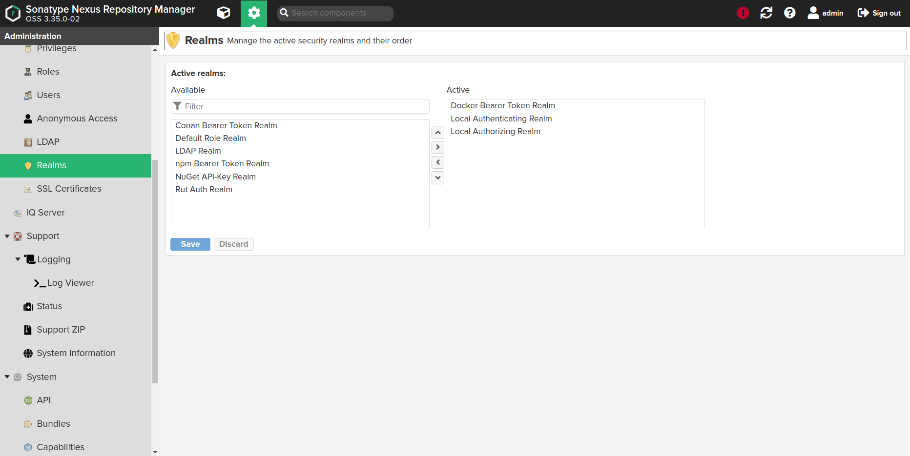
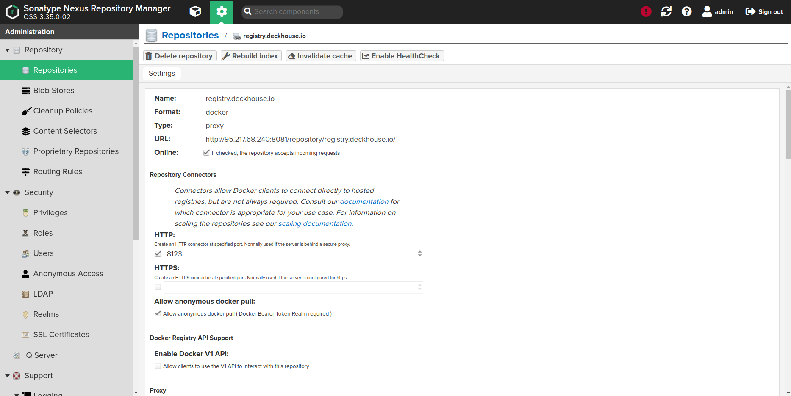
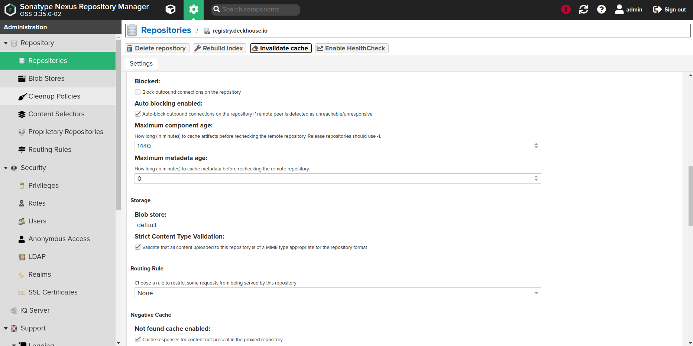

## Как узнать все параметры Deckhouse?

Все ключевые настройки Deckhouse, включая параметры модулей, хранятся в ConfigMap `deckhouse` namespace `d8-system`. Посмотреть содержимое:
```
kubectl -n d8-system get cm deckhouse -o yaml
```

## Как найти документацию по установленной у меня версии?

Документация запущенной в кластере версии Deckhouse доступна по адресу `deckhouse.<cluster_domain>`, где `<cluster_domain>` - DNS имя в соответствии с шаблоном из параметра `global.modules.publicDomainTemplate` конфигурации.

## Как установить желаемый канал обновлений?
Чтобы перейти на другой канал обновлений автоматически, минимизировав переключение версий в кластере, нужно у модуля изменить (установить) параметр `releaseChannel`. В этом случае включится механизм [автоматической стабилизации релизного канала](#как-работает-автоматическая-стабилизация-релизного-канала).

Пример конфигурации модуля:
```yaml
deckhouse: |
  releaseChannel: RockSolid
```

## Как работает автоматическая стабилизация релизного канала?
При указании в конфигурации параметра `releaseChannel`, Deckhouse сам переключит свой image на соответствующий тег Docker-образа. Дополнительных действий со стороны пользователя не требуется.

**Внимание:** переключение не происходит мгновенно и зависит от обновлений Deckhouse.

Каждые 10 минут запускается скрипт стабилизации канала обновлений, который реализует следующую логику:
* Если указанный канал обновлений соответствует тегу Docker-образа Deckhouse — ничего не произойдет;
* При смене канала обновлений на более стабильный (например с `Alpha` на `EarlyAccess`) будет произведен плавный переход:

  - Сначала проверяется равенство [digest](https://success.mirantis.com/article/images-tagging-vs-digests) для тегов Docker-образов, соответствующих текущему каналу обновлений и ближайшему к нему более стабильному (в примере — это каналы `Alpha` и `Beta`).

  - Если digest'ы равны, будет проверен следующий по очереди тег (в примере, это тэг соответствующий каналу обновлений `EarlyAccess`).

  - В результате, Deckhouse будет переключен на более стабильный канал обновлений c digest'ом, равным текущему.

* Если указан менее стабильный канал обновлений, чем тот, который соответствует текущему тегу Docker-образа Deckhouse — будет выполнена сверка digest'ов, соответствующих образам Docker для текущего канала обновлений и следующего, менее стабильного. Например, если необходимо перейти на канал `Alpha` с текущего канала `EarlyAccess`, — сравнивается `EarlyAccess` и `Beta`:

  - Если digest не равны, Deckhouse будет переключен на следующий канал обновлений (в нашем случае на `Beta`). Это необходимо, чтобы не пропустить важные миграции, которые  выполняются при обновлении Deckhouse.

  - Если digest равны, будет проверен следующий по убыванию стабильности канал обновлений (в нашем случае `Alpha`).

  - Когда проверка дойдет до желаемого канала обновлений (в примере — `Alpha`), переключение Deckhouse произойдет независимо от равенства digest.

В итоге, постоянный запуск скрипта стабилизации рано или поздно приведет Deckhouse к состоянию, при котором тег его Docker-образа будет соответствовать заданному каналу обновлений.

## Как запускать Deckhouse на произвольном узле?
Нужно у модуля `deckhouse` установить соответствующий [параметр](modules/020-deckhouse/configuration.html) `nodeSelector` и не задавать `tolerations`.  Необходимые значения `tolerations` в этом случае будут проставлены автоматически.

Также стоит избегать использования узлов **CloudEphemeral**. В противном случае может произойти ситуация, когда целевого узла нет в кластере и его заказ по какой-то причине невозможен.

Пример конфигурации модуля:
```yaml
deckhouse: |
  nodeSelector:
    node-role.deckhouse.io/deckhouse: ""
```
## Как установить Deckhouse из стороннего registry?

При установке, Deckhouse можно настроить на работу со сторонним registry (например, проксирующий registry внутри закрытого контура). 

### Подготовка конфигурации
Установите следующие параметры в ресурсе `InitConfiguration`:
- `imagesRepo: <PROXY_REGISTRY>/<DECKHOUSE_REPO_PATH>/<DECKHOUSE_REVISION>`. Адрес образа Deckhouse в стороннем registry с учетом используемой редакции - ce,ee или fe. Пример: `imagesRepo: registry.deckhouse.io/deckhouse/ce`.
- `registryDockerCfg: <BASE64>`. Права доступа к стороннему registry в BASE64.

Если разрешен анонимный доступ к образам Deckhouse в стороннем registry, то `registryDockerCfg` должен выглядеть следующим образом:
```json
{"auths": { "<PROXY_REGISTRY>": {}}}
```

Приведенное значение должно быть закодировано в BASE64.

Если для доступа к образам Deckhouse в стороннем registry необходима аутентификация, то `registryDockerCfg` должен выглядеть следующим образом:
```json
{"auths": { "<PROXY_REGISTRY>": {"username":"<PROXY_USERNAME>","password":"<PROXY_PASSWORD>","auth":"<AUTH_BASE64>"}}}
```

где `<AUTH_BASE64>` — это строка вида `<PROXY_USERNAME>:<PROXY_PASSWORD>`, закодированная в BASE64.

Итоговое значение для `registryDockerCfg` должно быть закодировано в BASE64.

* `<PROXY_USERNAME>` — имя пользователя для аутентификации на `<PROXY_REGISTRY>`.
* `<PROXY_PASSWORD>` — пароль пользователя для аутентификации на `<PROXY_REGISTRY>`.
* `<PROXY_REGISTRY>` — адрес стороннего registry в виде `<HOSTNAME>[:PORT]`.

Для настройки нестандартных конфигураций сторонних registry в ресурсе `InitConfiguration` предусмотрены еще два параметра:
- `registryCA` — корневой сертификат, которым можно проверить сертификат registry (если  registry использует самоподписанные сертификаты).
- `registryScheme` — протокол доступа к registry (`http` или `https`). По умолчанию - `https`.

### Установка
Укажите для `dhctl` параметр `--dont-use-public-control-plane-images`, чтобы он использовал образы `control-plane` из стороннего registry, вместо публичного (`k8s.gcr.io`).

### Особенности настройки сторонних registry

**Внимание:** Deckhouse поддерживает работу только с Bearer token-схемой авторизации в registry.

#### Nexus
При использовании [Nexus](https://github.com/sonatype/nexus-public) в режиме registry-прокси необходимо соблюдение нескольких условий:

* Включить `Docker Bearer Token Realm`


* Включить анонимный доступ к registry (иначе, [не будет работать](https://help.sonatype.com/repomanager3/system-configuration/user-authentication#UserAuthentication-security-realms) Bearer Token-авторизация)


* Установить `Maximum metadata age` в 0 (иначе, автоматическое обновление Deckhouse не будет работать корректно из-за кеширования)


## Как переключить работающий кластер Deckhouse на использование стороннего registry?

* Изменить секрет `d8-system/deckhouse-registry` (все параметры хранятся в кодировке BASE64):
  * Исправить `.dockerconfigjson` с учетом авторизации в новом registry.
  * Исправить `address` на адрес нового registry (например, `registry.example.com`).
  * Исправить `path` на путь к репозиторию Deckhouse в новом registry (например, `/deckhouse/fe`).
  * При необходимости, изменить `scheme` на `http` (если используется HTTP registry).
  * Если registry использует самоподписные сертификаты, то изменить или добавить поле `ca` куда внести корневой сертификат соответствующего сертификата registry.
* Выполнить рестарт Pod'а Deckhouse'а.
* Дождаться перехода Pod'а Deckhouse в статус Ready.
* Дождаться применения bashible новых настроек на мастер-узле. В журнале bashible на master-узле (`journalctl -u bashible`) должно появится сообщение `Configuration is in sync, nothing to do`.
* Изменить поле `image` в Deployment `d8-system/deckhouse` на адрес образа Deckhouse в новом registry.
