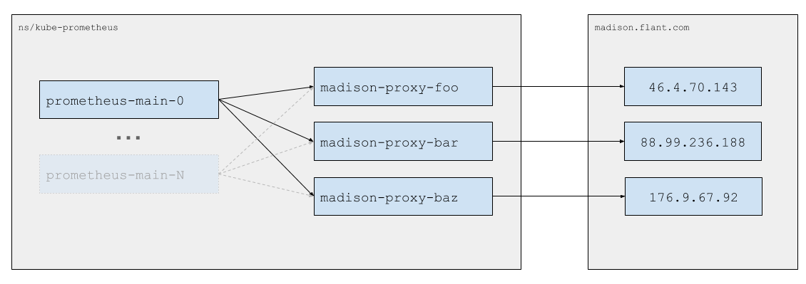

title: "Интеграция с Madison"

<!-- Исходник картинок: https://docs.google.com/drawings/d/1KMgawZD4q7jEYP-_g6FvUeJUaT3edro_u6_RsI3ZVvQ/edit -->

## Отправка алертов

### Общие сведения

* Prometheus шлет алерты в Madison, думая, что тот является Alertmanager'ом
* При отправке алертов Prometheus добавляет label `kubernetes={{ global.clusterName }}` (чтобы можно было понять что за
  кластер в тех проектах, где их несколько)

### Схема интеграции



* У модуля есть секретный value `flantIntegration.internal.madison.backends`, который заполняется автоматически списком адресов, в
  которые резолвится madison-direct.flant.com (каждые 10 минут).
* Для каждого адреса в `flantIntegration.internal.madison.backends` генерируется отдельный deployment с `madison-proxy` (в названии
  используется sha256sum от IP-адреса), который отправляет все запросы на соответствующий ему бекенд Madison'а (там нет
  mash, один `madison-proxy` шлет запросы на один бекенд Madison'а).
* `madison-proxy` это Nginx с [простейшим конфигом](https://fox.flant.com/sys/deckhouse-oss/-/tree/main/modules/ee/340-flant-integration/images/madison-proxy/rootfs/etc/nginx/nginx.tmpl)
  , задача которого — эмулировать Alertmanager для Prometheus'а и передавать все пришедшие запросы в Madison. Он
  использует `flantIntegration.madisonAuthKey` для аутентификации в Madison.
* Штатное поведение Prometheus'а — отправлять все алерты всем известным Alertmanager'ам. Так и происходит — каждый
  экземпляр Prometheus шлет информацию о каждом алерте каждому `madison-proxy`, который, в свою очередь, шлет алерт
  своему бекенду Madison'а (дедуплицировать алерты — задача Madison).
* Доставка алертов до Madison работает до тех пор, пока жива хотя бы одна цепочка `madison-proxy` -> `madison backend`.

### Зачем так сделано?

* Alertmanager изначально спроектирован как распределенная система с акцентом на AP (availability и partition tolerance,
  см. [CAP-теорему](https://en.wikipedia.org/wiki/CAP_theorem)) и готов работать в режиме split brain — ведь лучше
  получить дублирующийся алерт, чем не получить никакого алерта. Соответственно Prometheus штатно шлет информацию всем
  Alertmanager'ам, а они уже сами разбираются, как эту информацию синхронизировать друг с другом и дедуплицировать.
* Madison пока не является распределенной системой, но это стоит в самых ближайших планах. Будет 3-5 инсталляций Madison
  в "разных частях света", и, для обеспечения AP, нужно будет слать информацию в каждую инсталляцию.
* Madison уже сейчас работает в трех ЦОДах Hetzner (по крайней мере front'ы у кластера tfprod в трех разных ЦОДах), так
  что даже сейчас имеет полный смысл отправлять алерты на все фронты — при выходе из строя одного из ЦОДов алерты
  продолжат поступать в два других.
* Таким образом, хотя и не было явной необходимости делать столько `madison-proxy`, сколько сейчас фронтов, это очень
  хорошо легло в модель Prometheus'а, дало нам прямо сейчас некоторую дополнительную гарантию доставки и обеспечило
  сразу работающую схему на будущее, когда Madison станет распределенным.

## Автоматическая регистрация

* У Madison есть [API самонастройки](https://fox.flant.com/tnt/madison/issues/73), которое позволяет зарегистрировать 
  ключ для проекта. Регистрация проходит через специальный прокси-сервер connect.deckhouse.io, внутри которого спрятан
  общий ключ регистрации. Этот прокси-сервер проверяет валидность ключа лицензии и проксирует запрос регистрации в Madison.
* Чтобы зарегистрироваться, нужно иметь ключ лицензии. Он указывается в конфигурации по пути `flantIntegration.licenseKey`. 
  Модуль ([хук license](https://fox.flant.com/sys/deckhouse-oss/-/tree/main/ee/modules/340-flant-integration/hooks/license.go))
  записывает ключ лицензии в `flantIntegration.internal.licenseKey`. Если его нет в конфигурации, модуль пытается найти 
  его в конфигурации доступа к реестру контейнеров. 
* При каждом запуске deckhouse (точнее при каждой установке модуля):
    * если в `flantIntegration.madisonAuthKey` уже есть ключ, модуль пытается обновить данные проекта для этого ключа: 
      имя проекта и URL для grafana и prometheus.
    * если в `flantIntegration.madisonAuthKey` ничего нет, модуль ([хук registration](https://fox.flant.com/sys/deckhouse-oss/-/tree/main/ee/modules/340-flant-integration/hooks/madison/registration.go))
      пытается получить новый ключ в API самонастройки Madison (через прокси лицензий connect.deckhouse.io) и записать 
      его в `flantIntegration.madisonAuthKey`. Этот ключ и используется в `madison-proxy` для аутентификации в Madison;
* Список зарегистрированных ключей можно найти в Madison у каждого проекта — ключи
  называются `kubernetes-{{ global.clusterName }}`, например для tfprod
  можно [посмотреть здесь](https://madison.flant.com/projects/tfprod/prometheus_setups).
* При архивации кластера в Madison срабатывает механизм автоматического отключения алертов. Хук `madison_revoke`
  регулярно (раз в 5 минут) проверяет статус кластера в Madison и если тот архивирован, то хук делает следующее:
    * удаляет ключ `flantIntegration.madisonAuthKey` из хранилища values.

## Как можно посмотреть отправленные алерты в madison

Посмотреть логи отправленных алертов можно с помощью команды:

```shell
kubectl -n d8-monitoring logs -f -l app=madison-proxy
```

Если необходимо посмотреть логи отправки определенных алертов, то можно воспользоваться такой командой: Найти все
отправленные алерты `TargetDown`:

```shell
kubectl -n d8-monitoring  logs -f -l app=madison-proxy | grep POST  | jq '.body[] | select(.labels.alertname == "TargetDown")'
```

Найти все отправленные алерты `TargetDown` с лейблом `job=node-exporter`:

```shell
kubectl -n d8-monitoring  logs -f -l app=madison-proxy | grep POST  | jq '.body[] | select(.labels.alertname == "TargetDown" and .labels.job == "node-exporter")'
```

А вот так можно найти дату отправки и значение определенного лейбла:

```shell
kubectl -n d8-monitoring  logs -f -l app=madison-proxy | grep POST  | jq '.time_local + " " + (.body[] | select(.labels.alertname == "TargetDown" and .labels.job == "node-exporter") | .labels.severity_level)'
```
